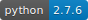

# Goal Metrics


Writinig a python programm to get the goal data as `[x, y, R, P, Y]` and compare it to the actual position
of the robot, given as `[x, y, R, P, Y]`. Calculate the distance and angle between the robot position and the goal.
Max allowed difference can be set as parameters.

## Timing
Best timing for 2 subscribed topics in `application.py` for `goal_metrics`:
```python
    rospy.sleep(.2)
    [...]
    rospy.sleep(3)
```
Timing with `rospy.sleep()` is necessary because otherwise there will be a threading error. The bagfile includes
the topics needed for `goal_metrics`.
```yaml
topics:      /atf/testblock_nav/api          2 msgs    : atf_msgs/Api                     
             /atf/testblock_nav/trigger      2 msgs    : atf_msgs/TestblockTrigger        
             /base_pose_ground_truth      1143 msgs    : nav_msgs/Odometry                
             /move_base/goal                 1 msg     : move_base_msgs/MoveBaseActionGoal
```
detailed example is shown below.
```python
class Application:
    def __init__(self):
        rp = RvizPublisher()
        filepath = '/home/flg-ma/git/catkin_ws/src/msh/msh_bringup/launch/t_passage.launch'
        rp.main(filepath, True, False, 2.0, 0.0, 0, 0, 0)
        rospy.sleep(.2)                     # improved speed with localisation
        self.atf = ATF()

    def execute(self):
        self.atf.start("testblock_nav")
        # necessary to catch goal published on topic /move_base/goal
        rospy.sleep(3)
        sss.move("base", [4.0, 0.0, 0.0])
        self.atf.stop("testblock_nav")
        self.atf.shutdown()

```


## History
**V 1.0.0:**
- first push

# HOW-TO New Metric
The following steps are needed to implement a new metrics in ATF:
### Python File
- Create new python-file for the metrics, using the following nameconvention:
```
calculate_*name*.py
```
- copy existing structure from one of the implemented metrics, looking like:
```python
class CalculatePublishRateParamHandler
    def parse_parameter(self, testblock_name, params):
class CalculatePublishRate:
    def __init__(self, groundtruth, groundtruth_epsilon):
    def start(self, timestamp):
    def stop(self, timestamp):  
    def pause(self, timestamp):
    def purge(self, timestamp):   
    def get_result(self):
```
  using the "publish\_rate"-metrics as an example. Replace "PublishRate" with the name of your newly generated metrics.
- In file ```atf/src/atf/atf_metrics/src/atf_metrics/__init__.py``` add:
```python
from atf_metrics.calculate_*name* import Calculate*Name*, Calculate*Name*ParamHandler
```
  e.g.
```python
from atf_metrics.calculate_jerk import CalculateJerk, CalculateJerkParamHandler
```
  here *name* stands for the name of your new metric (obviously).
  
- In file ```atf/src/atf/atf_metrics/config/metrics.yaml``` add:
```
*name*:
   handler: Calculate*Name*ParamHandler
```
  e.g.
```
jerk:
  handler: CalculateJerkParamHandler
```
### ATF Presenter
- In file ```atf/atf_presenter/html/js/atf_tools/test_list.js``` add (using "jerk" as an example):
```javascript
var plot_options = {
      jerk: {
        chart: {
          defaultSeriesType: 'column',
          type: 'column',
          zoomType: 'xy'
        },
        title: {
          text: 'Jerk'
        },
        yAxis: {
          title: {
            text: 'Jerk [m/s^3]'
          }
        },
        xAxis: {
          labels: {
            enabled: false
          }
        },
        plotOptions: {},
        tooltip: plot_tooltip
      },
};
```
  search the following if-statement:
```javascript
if ((metric_name == 'time') || (metric_name == 'path_length') || (metric_name == 'publish_rate') || (metric_name == 'interface') || (metric_name == 'jerk'))
```
  and add the new metrics as ```|| (metric_name == '*name*')```. In the following lines...
```javascript
if (metric_name == 'path_length') chart_legend_name = testblock_name + "<br>(" + metric_data['details']['root_frame'] + " to " + metric_data['details']['measured_frame'] + ")"
if (metric_name == 'publish_rate') chart_legend_name = testblock_name + "<br>(" + metric_data['details']['topic'] + ")"
if (metric_name == 'interface') chart_legend_name = testblock_name + "<br>(" + metric_data['details'] + ")"
if (metric_name == 'jerk') chart_legend_name = testblock_name + "<br>(" + metric_data['details']['topic'] + ")"
```
  add...
```javascript
if (metric_name == '*name*') chart_legend_name = testblock_name + "<br>(" + metric_data['details'] + ")"
```
To get additional information in the presenter. The "details" you store in the "metrics\_data" will be shown below the metrics-name in brackets.
